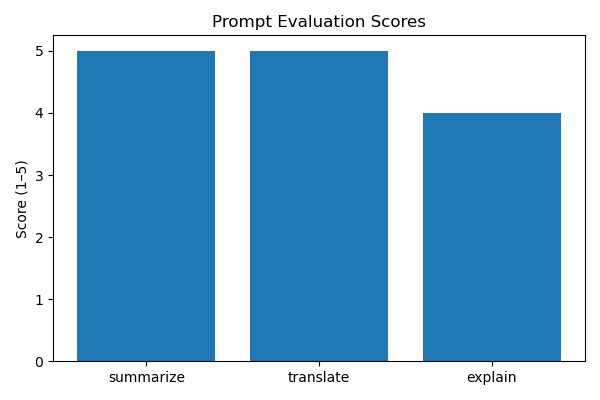

# 🧠 Prompt Engineering Portfolio Summary

This document summarizes all hands-on projects in the **Prompt Portfolio**, showcasing dataset testing, benchmarking, CLI tools, and an interactive web app.

---

## 📌 Project 1 — Prompt Playground
**Goal:** Load a dataset of prompts, run them via API or mock, and save outputs for evaluation.  
**Features:**
- Sample prompts in `datasets/sample_inputs.json`
- Runs saved to `reports/prompt_playground_results.csv`
- Notebook `01_prompt_playground.ipynb` for testing

**Status:** ✅ Complete  



---

## 📌 Project 2 — Prompt Tester CLI
**Goal:** Automate prompt runs with scoring and CSV/Markdown reporting.  
**Features:**
- CLI script `prompt_runner.py`  
- Scoring 1–5, factual correctness flag  
- Output CSVs in `reports/`

**Status:** ✅ Complete  

---

## 📌 Project 3 — Prompt Benchmark Suite
**Goal:** Compare multiple prompts across models and collect metrics.  
**Features:**
- `projects/prompt-benchmark/bench_prompts.json` for templates  
- Script `prompt_benchmark.py`  
- Metrics: speed, token cost, accuracy  
- Visualized via PNG charts

**Status:** ✅ Complete  

---

## 📌 Project 4 — Prompt-Lab Web App
**Goal:** Interactive Streamlit dashboard for testing prompts live.  
**Features:**
- Model & task selection (Summarize, Translate, Explain, Paraphrase)  
- Live API + mock prompt execution  
- Automatic CSV logging to `/reports/prompt_lab_runs.csv`  
- Cached history with refresh  
- Performance chart of response times

**Status:** ✅ Complete  

**Run Locally:**

```bash
streamlit run app.py
